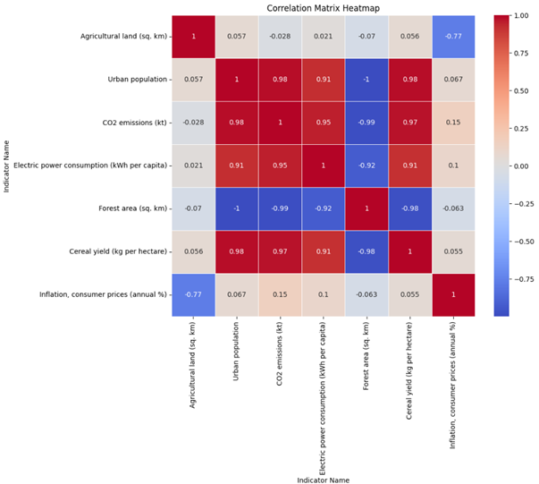
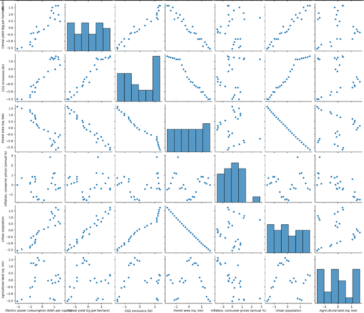

# Exercise Badges

    

#### Author
Omer Khan Jadoon

###### Project Title:
# Correlation between Various Climate Change Indicators and Economic Indicators in Pakistan

### Introduction
The objective of this analysis is to explore the correlation between various climate change indicators and economic indicators in Pakistan. This study aims to identify the environmental factors that significantly impact economic performance, highlighting areas for improvement to promote sustainable economic growth while addressing climate change challenges.

### Used Data
#### Data Sources
1. **Economy and Growth Data**
   - **Description:** Provides various economic indicators for Pakistan, including GDP, trade, and income statistics.
   - **Metadata URL:** [Economic Growth Metadata](#)
   - **Data URL:** [Economic Growth Data](#)
   - **Data Type:** CSV
2. **Climate Change Indicators Data**
   - **Description:** Includes climate-related indicators such as agricultural land area, CO2 emissions, and urban population affected by elevation changes.
   - **Metadata URL:** [Climate Change Metadata](#)
   - **Data URL:** [Climate Change Data](#)
   - **Data Type:** CSV

#### Data Structure and Quality
- **Economy and Growth Data:** Structured in a tabular format with columns for Country Name, Country ISO3, Year, Indicator Name, Indicator Code, and Value. The data is generally high quality, though some entries may have missing or inconsistent data.
- **Climate Change Indicators Data:** Similar structure with columns for Country Name, Country ISO3, Year, Indicator Name, Indicator Code, and Value. This dataset also requires cleaning to address missing or inconsistent entries.

#### Data Licenses
Both datasets are available under the Creative Commons Attribution license, which allows for free use, sharing, and adaptation, provided appropriate credit is given to the source.

### Analysis
#### Data Pipeline
- **Technology Used:** Implemented using Python with libraries such as Pandas, Matplotlib, Seaborn, and NumPy. Jupyter Notebook was used for development and documentation.
- **Transformation and Cleaning Steps:**
  1. Loading data into Pandas DataFrames.
  2. Initial inspection of data structure.
  3. Cleaning data by removing header rows, converting columns to numeric types, and handling missing or inconsistent data.
  4. Filtering data to include only the years between 1970 and 2014.
  5. Selecting key indicators: Agricultural land, Urban population, CO2 emissions, Electricity production, Forest area, and Cereal yield.
  6. Dropping rows with missing values and scaling data using MinMaxScaler.

#### Results and Interpretation
##### Correlation Analysis
The correlation matrix heatmap (Figure 1) highlights the relationships between various climate change indicators and economic indicators in Pakistan. Key observations include:

1. **High Positive Correlations:**
   - **Urban population and CO2 emissions (0.98):** As the urban population increases, CO2 emissions also tend to increase, indicating urbanization's impact on carbon emissions.
   - **CO2 emissions and Electric power consumption (0.95):** Increased electric power consumption is associated with higher CO2 emissions, reflecting the energy sector's contribution to carbon emissions.
   - **Urban population and Electric power consumption (0.91):** Urban population growth drives higher electricity demand, which aligns with increased CO2 emissions.
   - **Cereal yield and CO2 emissions (0.97):** Higher agricultural productivity (cereal yield) correlates with increased CO2 emissions, possibly due to intensified agricultural activities.
   
2. **High Negative Correlations:**
   - **Agricultural land and Inflation (-0.77):** Larger agricultural land areas are associated with lower inflation rates, suggesting that extensive agriculture might help stabilize food prices.
   - **Forest area and Urban population (-1.0):** Urban expansion typically leads to deforestation, as indicated by the perfect negative correlation.
   - **Forest area and CO2 emissions (-0.99):** Increased forest area correlates with lower CO2 emissions, underscoring the importance of forests in carbon sequestration.

3. **Moderate Correlations:**
   - **Agricultural land and Urban population (0.057):** There is a very weak positive correlation, indicating minimal direct relationship.
   - **Inflation and CO2 emissions (0.15):** Slight positive correlation suggests that higher CO2 emissions could be associated with increased inflation, though this relationship is weak.

###### Figure 1: Correlation Matrix between various climate and economic factors

##### Pairplot Analysis
The pairplot (Figure 2) provides a visual representation of the relationships between pairs of indicators. Notable patterns include:
- **Positive Linear Relationships:** Confirmed between urban population, CO2 emissions, and electric power consumption, as well as cereal yield and CO2 emissions.
- **Negative Linear Relationships:** Evident between forest area and urban population, CO2 emissions, and electric power consumption.
- **Distribution Insights:** Histogram plots on the diagonal reveal the distribution of individual indicators, highlighting their variance and skewness.

###### Figure 2: Pairplot for highly correlated Indicators

##### Causality Analysis
Granger causality tests were conducted to investigate potential causal relationships between selected pairs of indicators:
- **Urban Population and CO2 Emissions:** Urban population growth Granger-causes CO2 emissions, suggesting that urbanization is a significant driver of increased carbon emissions.
- **CO2 Emissions and Electric Power Consumption:** CO2 emissions Granger-cause electric power consumption, indicating feedback loops where higher emissions could lead to policy changes affecting power consumption patterns.
- **Agricultural Land and Inflation:** Agricultural land area Granger-causes inflation, supporting the observation that extensive agriculture can help control food prices and inflation.

### Conclusion
The analysis revealed significant correlations between certain climate change indicators and economic performance in Pakistan. Key findings include:
- **Correlated Indicators:** Identified through a heatmap and pairplot visualizations.
- **Predictive Power:** Certain climate indicators demonstrated predictive power over economic indicators, as indicated by Granger causality tests.
This README format is clear, organized, and easy to read. The use of markdown elements like 